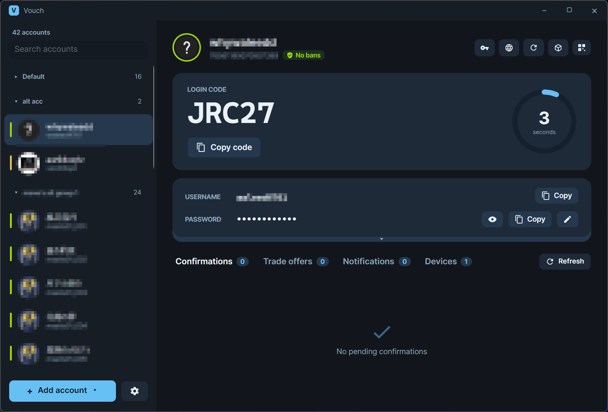
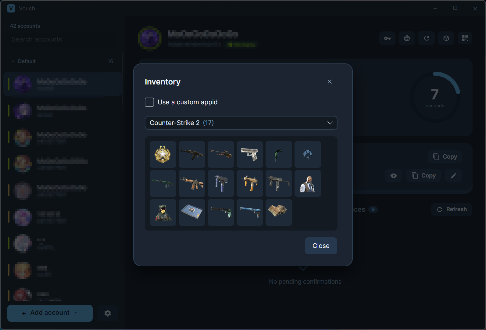
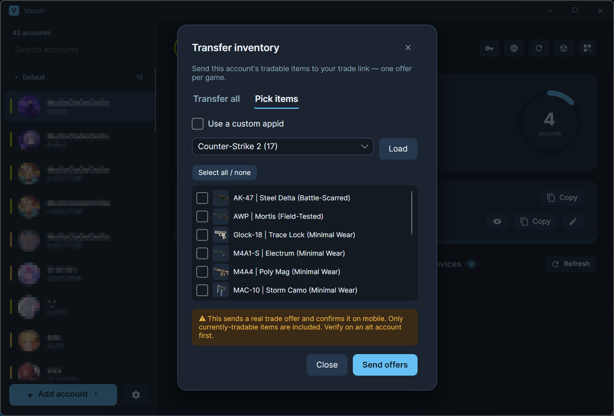
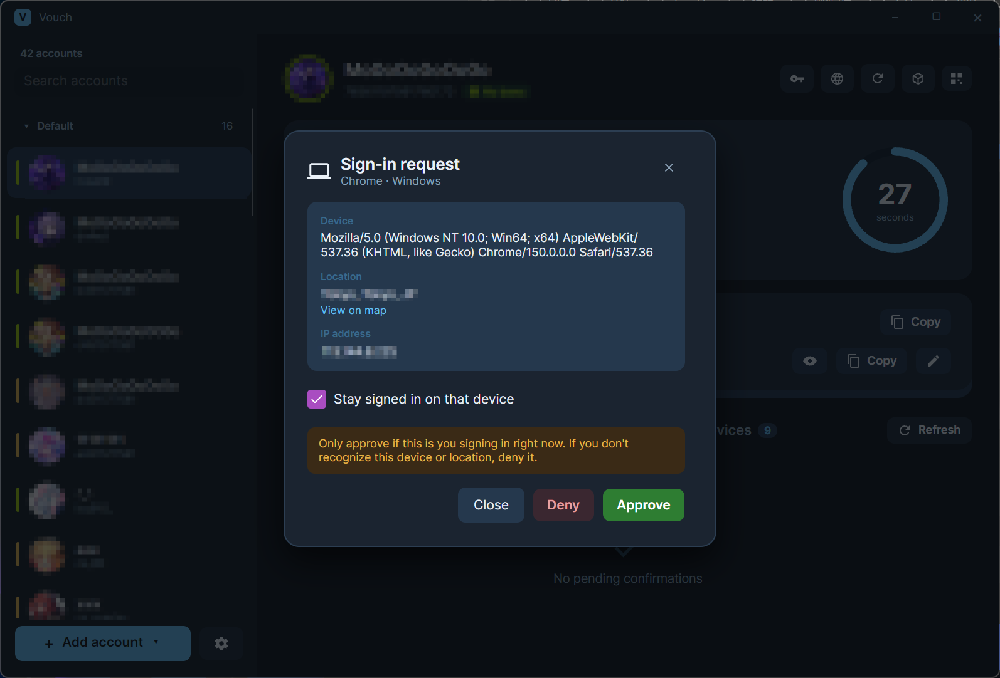

# Vouch

[English](../README.md) · [中文](README.zh-CN.md) · **Русский** · [日本語](README.ja.md)

Современный кроссплатформенный **аутентификатор Steam** для десктопа — написанная
с нуля реализация заброшенного
[Steam Desktop Authenticator](https://github.com/Jessecar96/SteamDesktopAuthenticator),
построенная на Avalonia с удобным интерфейсом для нескольких аккаунтов.

Управляйте множеством аккаунтов Steam, генерируйте коды для входа, подтверждайте
торговые и рыночные операции, просматривайте и отвечайте на торговые предложения,
просматривайте и переносите инвентарь, подтверждайте входы, управляйте устройствами
с активным входом в аккаунт, привязывайте и отвязывайте аутентификаторы — всё в одном
приложении.

- **Стек:** Avalonia 12 (Fluent) · .NET 10 · CommunityToolkit.Mvvm · SteamKit2 для входа + прямой HTTP к Steam
- **Платформы:** Windows (основная), Linux, macOS
- **Языки:** English · 简体中文 · Русский · 日本語 (переключение на лету)

## Скриншоты

<p align="center">
  
  
  
  
</p>

---

## ⚠️ Безопасность — прочтите в первую очередь

**Ваш `.maFile` — это ваш аккаунт.** Он содержит seed для 2FA (`shared_secret`),
ключ мобильных подтверждений (`identity_secret`), код отзыва, актуальные токены
сессии и — в этом приложении — ваш **пароль** от Steam. Любой, кто получит
расшифрованный maFile, может полностью захватить аккаунт.

**Скачивайте Vouch только из официального репозитория:**

> ### https://github.com/Monodesu/Vouch

Любая другая сборка — «зеркало», перезалив или релиз форка — **может содержать
бэкдор для кражи ваших maFiles**. Если вы получили её не по ссылке выше, считайте
её вредоносной. Vouch никогда не отправляет ваши секреты или пароль куда-либо,
кроме собственных серверов Steam.

**Шифруйте файлы на диске:** включите **Настройки → Шифровать maFiles на диске**
и задайте пароль-ключ. После этого каждый maFile (включая ваш пароль)
шифруется на диске с помощью **Argon2id** (деривация ключа) и **AES-256-GCM** — неверный пароль-ключ или подделка файла обнаруживаются, а не расшифровываются неверно; пароль-ключ вводится один раз за запуск.
Шифрование защищает файлы на диске — оно **не** защитит вас от запуска
подделанной сборки, поэтому загрузка только из официального репозитория так же
важна.

---

## Возможности

### Аккаунты
- Боковая панель с несколькими аккаунтами: **поиск**, **множественный выбор** и **перетаскивание для сортировки** (в том числе между группами)
- **Группы**: организуйте аккаунты в сворачиваемые группы (правый клик → переместить в /
  новая группа), с группой по умолчанию для остальных — порядок и состояние сворачивания сохраняются
- Актуальный **код входа TOTP** с кольцом обратного отсчёта; копирование в один клик
- Копирование имени пользователя / пароля; редактирование сохранённого пароля прямо на месте; произвольная **заметка для каждого аккаунта** (хранится в maFile)
- Аватар, отображаемое имя и **уровень / баны** Steam (VAC · игровые · торговые)
- Наглядный **статус сессии** — выполнен вход / истёк / вход не выполнялся — показывается полосой в боковой панели, кольцом вокруг аватара и подписью

### Вход
- Вход с сохранённым паролем (запрашивается только при его отсутствии/неверности)
- **Повторный вход** отображается, когда действующая сессия ещё существует
- Коды Steam Guard по email обрабатываются в отдельном диалоге
- **Пакетный вход / обновление информации** по выделению
- **Подтверждение входа из Vouch** — вход, начатый в другом месте (без ввода кода), можно **подтвердить или отклонить** здесь, как в мобильном приложении
- **Вход по QR-коду** — подтвердите QR-код входа в Steam, считанный из буфера обмена или снимка всего экрана

### Устройства
- **Устройства с активным входом**: список активных сессий входа аккаунта с возможностью **выйти** из любой из них
- **Выход со всех устройств** для одного аккаунта или всего выделения, с возможностью снова войти в Vouch после этого

### Подтверждения и предложения
- Торговые и рыночные **подтверждения**: принять / отклонить, по одному или пакетно
- Фоновый обход всех вошедших аккаунтов с **системным уведомлением** о новом
  подтверждении или входящем торговом предложении (без дубликатов, включается в Настройках)
- **Торговые предложения**: просмотр активных предложений, открытие диалога с деталями,
  **изображениями** предметов, аватарами/именами/SteamID обеих сторон, а также уровнем,
  датой регистрации и статусом дружбы партнёра — затем **принять / отклонить / отменить**
- Список **уведомлений** с отметкой прочитанного / отметкой всех как прочитанных

### Инвентарь
- **Просмотр инвентаря**: просматривайте предметы аккаунта прямо в приложении — только те игры, в которых действительно есть предметы (как в собственном раскрывающемся списке Steam), со значками и количеством
- **Перенос**: отправка обмениваемых предметов аккаунта на настроенную ссылку обмена — **все предметы** или **выбранные вручную** (с изображениями), по одному предложению на игру; предустановленные игры (CS2, TF2, Dota 2, Rust, Steam) плюс **произвольный appid**; автоматически подтверждает предложение на мобильном устройстве

### Управление аутентификатором
- Мастер **добавления аутентификатора** — работает **без номера телефона** (Steam присылает
  код завершения на email); код отзыва показывается и повторно подтверждается в отдельном диалоге.
  После добавления новый аккаунт автоматически выполняет вход
- **Деактивация аутентификатора** в Steam для выделения, с использованием сохранённого
  кода отзыва каждого аккаунта (пакетно), после чего они удаляются из приложения

### Синхронизация конфигурации CS2
- Копирование **настроек / привязок клавиш / видеоконфигурации CS2** одного аккаунта на другие
  (все, группу или выбранные вручную), с автоматическим **резервным копированием** и **восстановлением** в один клик

### Приложение
- maFiles, зашифрованные на диске (один пароль-ключ, вводится один раз за запуск)
- Светлая / тёмная тема, значок в трее + сворачивание в трей, запуск свёрнутым
- Настраиваемая периодичность проверок, автоочистка буфера обмена, необязательный ключ Web API
- Встроенная **проверка обновлений** по GitHub Releases

---

## Загрузка

Возьмите последний **`Vouch-vX.Y.Z-win-x64.exe`** на странице
[Releases](https://github.com/Monodesu/Vouch/releases). Это единственный файл
(зависящий от фреймворка), для которого нужен установленный
**[.NET 10 Desktop Runtime](https://dotnet.microsoft.com/download/dotnet/10.0)**.
Просто запустите его — установщик не требуется.

## Сборка из исходников

Требуется **.NET 10 SDK**.

```bash
git clone https://github.com/Monodesu/Vouch.git
cd Vouch

dotnet run --project Vouch.App        # run
dotnet test Vouch.Core.Tests          # tests
```

Соберите единый exe самостоятельно:

```bash
dotnet publish Vouch.App/Vouch.App.csproj -c Release -r win-x64 \
  --self-contained false -p:PublishSingleFile=true \
  -p:IncludeNativeLibrariesForSelfExtract=true -o publish
# (delete publish/*.pdb; use --self-contained true for a no-runtime-needed build)
```

## Структура проекта

| Путь | Что это |
|------|-----------|
| `Vouch.App/` | Десктопное приложение Avalonia — представления, view models, диалоги, ресурсы |
| `Vouch.Core/` | Логика Steam: TOTP, подтверждения, предложения, инвентарь, привязка, хранилище — без UI |
| `Vouch.Core.Tests/` | Тесты xUnit для чистой логики и разбора |

## Где хранятся данные

Все данные **портативны** и лежат рядом с exe:

- `maFiles/` — ваши аккаунты (тот же формат на диске, что и у оригинального SDA; шифруются на месте при включении шифрования)
- `settings.json` — настройки приложения
- `cache/` — кэш аватаров

Местоположение можно переопределить переменной окружения `VOUCH_DATA_DIR`.

## Обновления

Vouch по запросу проверяет GitHub Releases на наличие более нового тега (Настройки → Проверить
обновления) и даёт ссылку на страницу релиза. Релизы создаются автоматически через CI
при отправке тега `v*`.

## Лицензия

Распространяется под [GNU Affero General Public License v3.0](LICENSE). Производные
работы — **включая те, что предоставляются по сети** — также должны выпускаться с
открытым исходным кодом под AGPL.

Vouch является производным от оригинального **Steam Desktop Authenticator** под
лицензией MIT авторства Jesse Cardone; этот копирайт сохранён в [NOTICE](NOTICE).

## Благодарности

- [Steam Desktop Authenticator](https://github.com/Jessecar96/SteamDesktopAuthenticator) — оригинал, за формат maFile и процессы привязки/подтверждения, которые он впервые реализовал
- [Avalonia](https://avaloniaui.net/) — кроссплатформенный UI-фреймворк

## Зависимости

- [Avalonia](https://avaloniaui.net/) — кроссплатформенный UI-фреймворк (тема Fluent, шрифт Inter) (MIT)
- [CommunityToolkit.Mvvm](https://github.com/CommunityToolkit/dotnet) — генераторы кода MVVM (MIT)
- [SteamKit2](https://github.com/SteamRE/SteamKit) — вход/аутентификация в Steam; библиотека сообщества (SteamRE), **не** связана с Valve (LGPL-2.1)
- [Konscious.Security.Cryptography](https://github.com/kmaragon/Konscious.Security.Cryptography) — деривация ключей Argon2id (шифрование maFile) (MIT)
- [xUnit](https://xunit.net/) — модульные тесты (Apache-2.0)

Ядро аутентификатора (TOTP, формат maFile, привязка, мобильное подтверждение) — это нативный порт на C# библиотеки [SteamAuth](https://github.com/geel9/SteamAuth) авторства Joshua Coffey / geel9 (MIT). Полные тексты сторонних лицензий — в [NOTICE](NOTICE).

---

> **Отказ от ответственности:** Vouch не связан с Valve и не одобрен ею. Steam —
> товарный знак Valve Corporation. Используйте на свой страх и риск.
